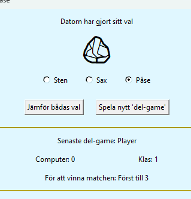
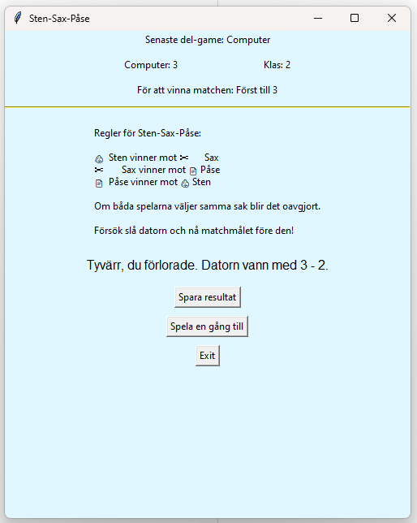
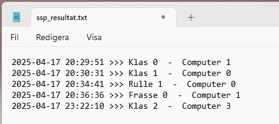
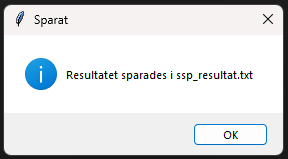

<h2>PythonKurs Inlämningsuppgift 1 - projekt 3</h2>
<h1>Sten-Sax-Påse</h1>
<h3>PythonKurs_In1_p3_StenSaxP-se</h3>
 

    <h4>Uppgift</h4>
     Skapa en version av spelet sten-sax-påse.
     · Datorn slumpar vilken av sten, sax eller påse den ska välja.
     · Spelaren väljer också sten, sax eller påse.
     · Datorn och spelaren visar sedan upp sina val samtidigt.
     · Reglerna är enligt följande: sten vinner över sax, sax vinner över påse, och påse vinner över sten. Om båda väljer samma alternativ blir det oavgjort.
     · Spelaren spelar tills hen vinner eller förlorar mot datorn.

    <h2> :>> py .\ssp.py  </h2>
     Programmet startas från terminal :>> py .\ssp.py
     Programmet består huvudsakligen av två fönstersidor (Widget's) som spelaren styr programmet från. Figur 1 visar utseendet på första widgeten som poppar upp efter programstart. Widgeten i figur 1 är uppdelad i två fält separerade av en horisontell linje. I det övre fältet startas programmet och i undre finns uppgifter om spelregler och personer i spelprogrammets utveckling.
     

    <h3> Figure 1 </h3>
    <h2> För att spela: </h2>
     Skriv in namnet på spelaren i inmatningsfält högst upp på Widgeten, i figur 1  har redan namnet "Klas" skrivits in. Via dropdown menyn väljer spelaren det antal 'del-game' som skall spelas innan en match är avgjord, se figur 2. I Sten-Sax-Påse gäller att "Först till 5" är ett default förvalt värde.
     

    <h3> Figure 2 </h3>
     
    <h4> Datorn funderar </h4>
     
     Sten-Sax-Påse startas genom ett tryck på Button "Börja Spela", som sitter strax under dropdown menyn. Den aktiverar spelet och programmets 2:a Widget poppar upp enligt figure 3. Direkt då spelet kickar igång, och ny Widget poppar upp funderar datorn på vad den ska välja, Sten-Sax-Påse, vilket syns högst upp på översta raden, från texten "Datorn funderar". Samtidigt som datorn funderar byts ikonerna att stilisera Sten-Sax-Påse, ca 3 ggr/sekund. Det tar datorn mellan en och fyra sekunder att göra sitt val, och fram till dess datorvalet är gjort är knappen om att "Jämföra bådas val" disablad och 'utgråad'.
     Medelst Radiobuttons utför spelaren, här Klas, sitt val av Sten-Sax-Påse. Radiobutton är inte disablad för tiden då Datorn funderar, utan spelaren kan utföra sitt val samtidigt som datorn utför sitt val.
     

    <h3> Figure 3 </h3>
     
    <h4> Datorn har gjort sitt val </h4>
     
     Då datorn gjort sitt val av Sten-Sax-Påse står detta i klartext högst upp i Widgeten, se figur 4. I och med detta har också Button "Jämför bådas val" blivit aktiv och inte längre disable-grå i sin ton. Men knappen till höger, "Spela nytt 'del-game'" är fortfarande disable-grå och icke aktiv, vilket den kommer vara fram till dess att spelaren jämfört bådas val genom tryck på knappen "Jämför bådas val". I figur 4 kan det tyckas att datorn valt en sten, där visas en sten-ikon. Men Datorns val visas först då spelaren trycket på knappen "Jämför bådas val".
     
     

    <h3> Figure 4 </h3>
     
     
    <h4> Första poängen </h4>
     
     Spelarens tryck på "Jämför bådas val" gav resultat enligt figur 5. Datorn hade valt sten och spelaren Klas valde Påse, som slår sten - varför Klas erhöll ett poäng. Dessutom, nu är knappen "Spela nytt 'del-game'" aktiverad, så nu kan ytterligare en gissningsrunda utföras. Och så fortsätter programmet fram till dess spelaren eller datorn vunnit det antal om,gångar som krävs för att vinna matchen.
     

    <h3> Figure 5 </h3>
     
     
    <h4> Vinst vid färdig spelomgång </h4>
     
     Efter färdig Match kan resultatet bli som i figur 6, spelaren förlorade med 1 poäng. 
     

<h3> Figure 6 </h3>

     
     
    <h4> Spara resultat </h4>
     
     Om matchen uppfattades som bra, kanske spelaren vill spara de numeriska värdena på fil från spelomgången. Detta utförs genom att välja Button "Spara resultat" från Figur 6. Ett sådant tryck resulterar i att spelresultatet mellan spelaren och datorn sparas till textfilen "ssp_resultat.txt", se figur 7, och att ett pop-up-fönster visas som en messagebox, se figur 8. För att fortsätta spelet krävs det att pop-up-fönstret konfirmeras via dess "OK" Button.
     

<h3> Figure 7 </h3>
 

<h3> Figure 8 </h3>

     
     
    <h4> Spela en gång till? </h4>
     
     Önskas en spelomgång till? Tryck i så fall på Button "Spela en gång till", figur 6 - som skickar tillbaka spelaren till position motsvarande start i spelet, figur 1. Är det dags att sluta, tryck då "Exit" vilket teminerar programmet.
     
     
     
      Lars Thomsson med god hjälp från ChatGPT
      17-april-2025

