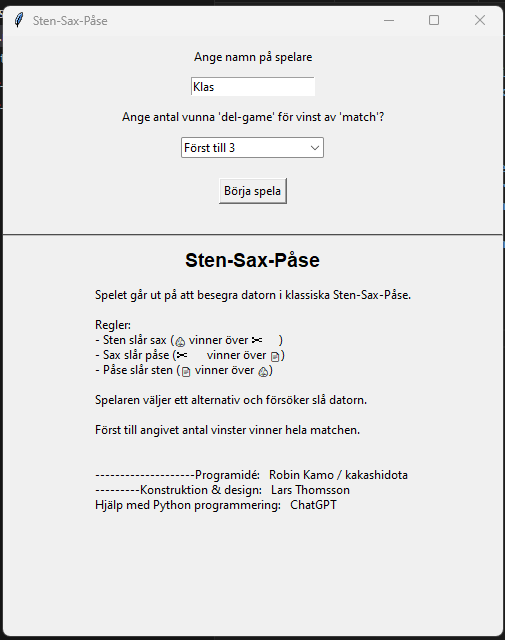
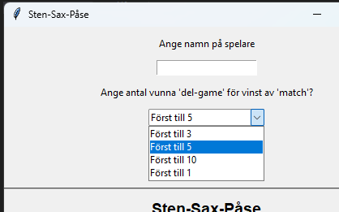
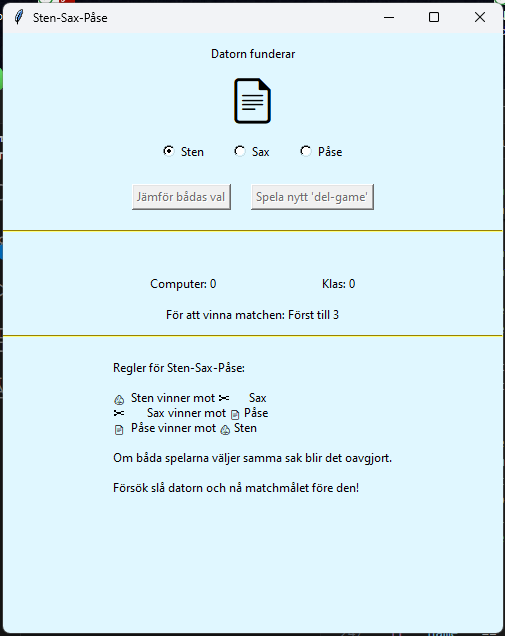
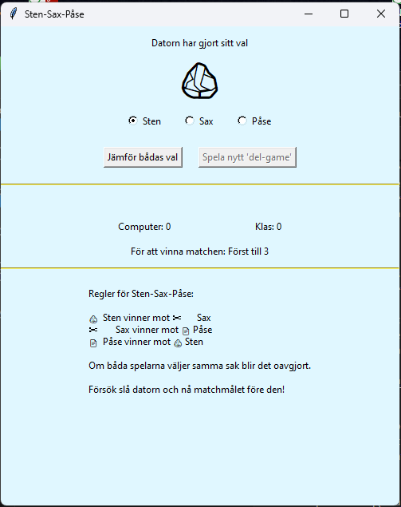

<h2>PythonKurs Inlämningsuppgift 1 - projekt 3</h2>
<h1>Sten-Sax-Påse</h1>
<h3>PythonKurs_In1_p3_StenSaxP-se</h3>
 

    <h4>Uppgift</h4>
     Skapa en version av spelet sten-sax-påse.
     · Datorn slumpar vilken av sten, sax eller påse den ska välja.
     · Spelaren väljer också sten, sax eller påse.
     · Datorn och spelaren visar sedan upp sina val samtidigt.
     · Reglerna är enligt följande: sten vinner över sax, sax vinner över påse, och påse vinner över sten. Om båda väljer samma alternativ blir det oavgjort.
     · Spelaren spelar tills hen vinner eller förlorar mot datorn.

    <h2> :>> py .\ssp.py  </h2>
     Programmet startas från terminal :>> py .\ssp.py
     Programmet består huvudsakligen av två fönstersidor (Widget's) som spelaren styr programmet från. Figur 1 visar utseendet på första widgeten som poppar upp efter programstart. Widgeten i figur 1 är uppdelad i två fält separerade av en horisontell linje. I det övre fältet startas programmet och i undre finns uppgifter om spelregler och personer i spelprogrammets utveckling.
     

    <h3> Figure 1 </h3>
    <h2> För att spela: </h2>
     Skriv in namnet på spelaren i inmatningsfält högst upp på Widgeten, i figur 1  har redan namnet "Klas" skrivits in. Via dropdown menyn väljer spelaren det antal 'del-game' som skall spelas innan en match är avgjord, se figur 2. I Sten-Sax-Påse gäller att "Först till 5" är ett default förvalt värde.
     

    <h3> Figure 2 </h3>
     
     Sten-Sax-Påse startas genom ett tryck på Button "Börja Spela", som sitter strax under dropdown menyn. Den aktiverar spelet och programmets 2:a Widget poppar upp enligt figure 3. Direkt då spelet kickar igång, och ny Widget poppar upp funderar datorn på vad den ska välja, Sten-Sax-Påse, vilket syns högst upp på översta raden, från texten "Datorn funderar". Samtidigt som datorn funderar byts ikonerna att stilisera Sten-Sax-Påse, ca 3 ggr/sekund. Det tar datorn mellan en och fyra sekunder att göra sitt val, och fram till dess datorvalet är gjort är knappen om att "Jämföra bådas val" disablad och 'utgråad'.
     Medelst Radiobuttons utför spelaren, här Klas, sitt val av Sten-Sax-Påse. Radiobutton är inte disablad under tiden Datorn funderar, utan spelaren kan utföra sitt val samtidigt som datorn utför sitt val.
     

    <h3> Figure 3 </h3>
     
     

    <h3> Figure 4 </h3>
     
     

